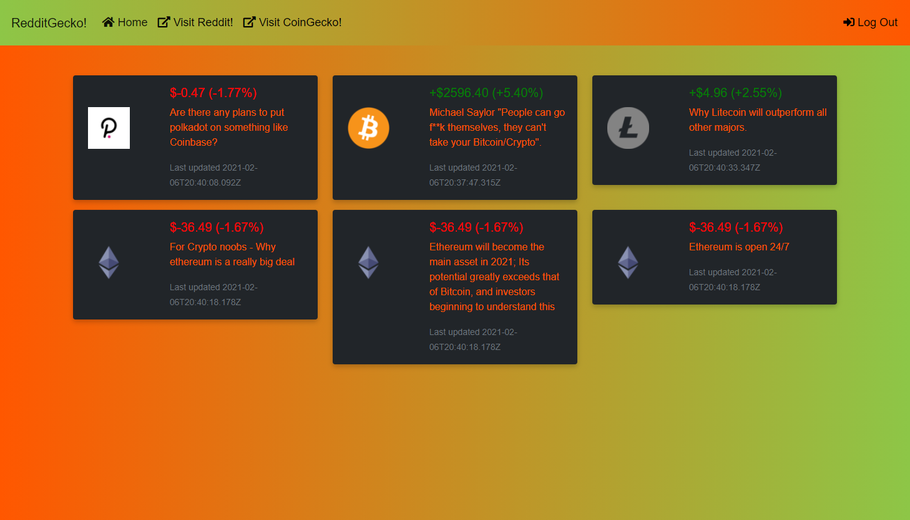

# RedditGecko!

### - A smart tracker for cypto lovers and reddit fans!

**Deployed application URL**
https://gio86krt.github.io/FrontEnd-EasyRedditTrackerForCrypto/

**GitHub Repository URL**
https://github.com/Gio86krt/FrontEnd-EasyRedditTrackerForCrypto

## Screenshot

## Table of Contents

- [Description](#description)
- [User_Story](#user_Story)
- [Features](#features)
- [Acceptance_Criteria](#acceptance_Criteria)
- [Wireframe](#wireframe)
- [Credits](#credits)
- [License](#license)
- [Badges](#badges)
- [Contributing](#contributing)
- [Tests](#tests)

## Description

RedditGecko! is a response web app that automatically pushes Reddit news feed on on crypto currencies. Once the user logged in, he is presented with a sticker board which has 6 automatically updating stickers. Each sticker includes a type of crypto currency, its price information in the past 24 hours and a relevant Reddit about it. By combing price information and Reddit post, RedditEcko! gives the user a cut-edge adavange in information gathering for crypto currency.

### User_Story

- You are an investor in cryptocurrency.
- You need a web host where you can easily track my crypto currency investment.
- With the web host, you will be able to store your investment info, and keep updated with latest related Reddit posts.

### Features

**What needs are we meeting?**

- Information is probablly the most valuable resource to crypto currency investor nowdays. Among all the new different information sharing platforms, Reddit is the most popular one. However, the nature of Reddit doesn't give the user options to quickly peak into the information. Moreover, switching between price index sites and Reddit page can be pain when user is trying to track multiple crypto currencies. With RedditGecko!, we want to deliver a integrated experience that:

1. Display the crucial price information together with the Reddit post.
2. Automatically refresh and generate new Reddit posts to keep user update to market movement.

**What would be the foreseeable consequence of the needs if unmet?**

- If we do not meet the aforementioned needs of the investors, then:

1. The investors will not be supplied with the broad array of options, so they may make an informed and confident decision in engaging in cryptocurrency investment.
2. We will not be able to inspire others to push our global interactions to the next step in history.

**What were our goals?**

- Wire up two server-side APIs.
- Construct a responsive UI.
- Create an interactive UI(i.e. respond to User's input).
- Use the client-side storage to store User's data object.
- Use a CSS framework: Bootstrap, but do NOT use JS popup dialogue boxes (i.e. JS alerts, confirms, or prompts).
- Exercise best coding practice.
- Deploy a working application to GitHub Repo.

**What have we done about it?**

- Wire up two server-side APIs:
  - **_Reddit and CoinGecko_**
- Construct a responsive UI:
  - **_Used Bootstrap_**
- Create an interactive UI(i.e. respond to User's input):
  - **_Used Bootstrap, JS, DOM_**
- Use the client-side storage to store User's data object.
  - **_Used localStorage_**
- Use a CSS framework: Bootstrap, but do NOT use JS popup dialogue boxes (i.e. JS alerts, confirms, or prompts).
  - **_Done_**
- Exercise best coding practice.
  - **_Done_**
- Deploy a working application to GitHub Repo.
  - **_Done_**

### Acceptance_Criteria

- GIVEN I am entering the web host,
  - WHEN I sign up,
    - THEN I am given a log-in data.
  - WHEN I log in,
    - THEN I am presented with a board with reddit stickers.
  - WHEN I click on Reddit link in nav bar,
    - THEN I am redirected to Reddit to see more about crypto currency;
  - WHEN I click on GoingEcko link in nav bar,
    - THEN I am redirected to GoingEcko to see more price index.

## Credits

#### Product Owner

_Full Stack Developer - Sam K_
Contact Him on GitHub: https://github.com/TalkingSkunk

#### Scrum Master

_Full Stack Developer - Richard Y_
Contact Him on GitHub: https://github.com/Dragontalker

#### Scrum Team

##### UI-UX Designer

_Front End Developer - Shiva S_
Contact Her on GitHub: https://github.com/shiva-shiva

##### API and data related

_Back End Developer - Giovanni O_
Contact Him on GitHub: https://github.com/Gio86krt

_DevOps - Max H_
Contact Him on GitHub: https://github.com/Simplyloveall

**Honourable Mentions**
Thanks to @Fil and @Luca B for their many guidances in this work.

**Third Party Asset Attributions**
https://getbootstrap.com/

**Tutorials**
https://www.w3schools.com/

## License

MIT License

Copyright (c) [2021] [Team-Force]

Permission is hereby granted, free of charge, to any person obtaining a copy
of this software and associated documentation files (the "Software"), to deal
in the Software without restriction, including without limitation the rights
to use, copy, modify, merge, publish, distribute, sublicense, and/or sell
copies of the Software, and to permit persons to whom the Software is
furnished to do so, subject to the following conditions:

The above copyright notice and this permission notice shall be included in all
copies or substantial portions of the Software.

THE SOFTWARE IS PROVIDED "AS IS", WITHOUT WARRANTY OF ANY KIND, EXPRESS OR
IMPLIED, INCLUDING BUT NOT LIMITED TO THE WARRANTIES OF MERCHANTABILITY,
FITNESS FOR A PARTICULAR PURPOSE AND NONINFRINGEMENT. IN NO EVENT SHALL THE
AUTHORS OR COPYRIGHT HOLDERS BE LIABLE FOR ANY CLAIM, DAMAGES OR OTHER
LIABILITY, WHETHER IN AN ACTION OF CONTRACT, TORT OR OTHERWISE, ARISING FROM,
OUT OF OR IN CONNECTION WITH THE SOFTWARE OR THE USE OR OTHER DEALINGS IN THE
SOFTWARE.

## Badges

## Contributing

[Contributor Covenant](https://www.contributor-covenant.org/version/2/0/code_of_conduct/code_of_conduct.md)

&copy; 2021 Team-Force
